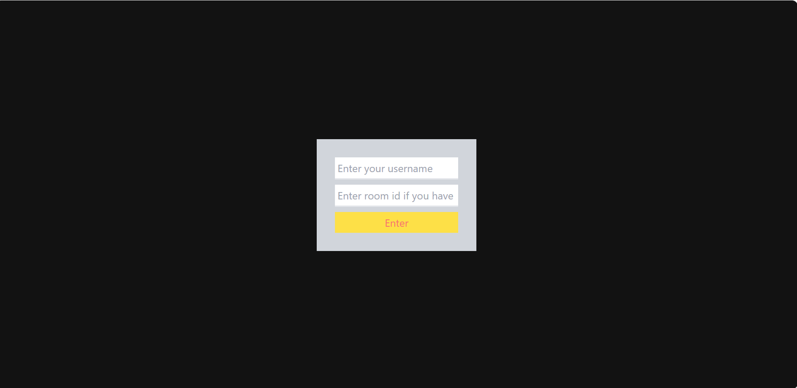
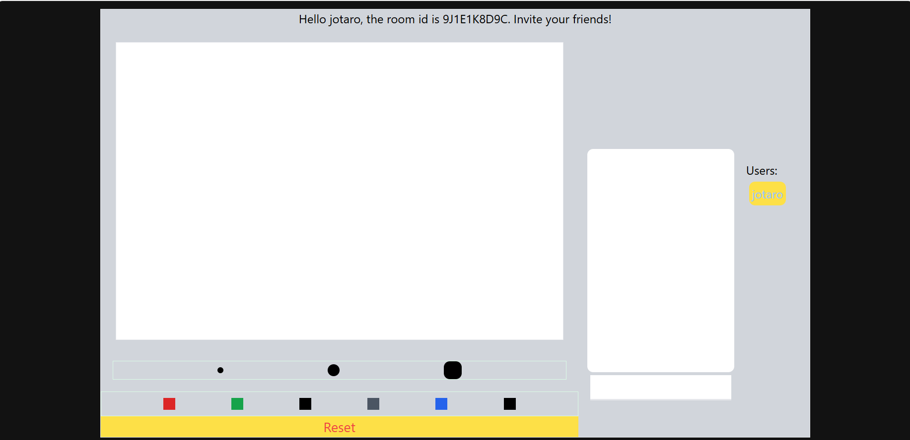
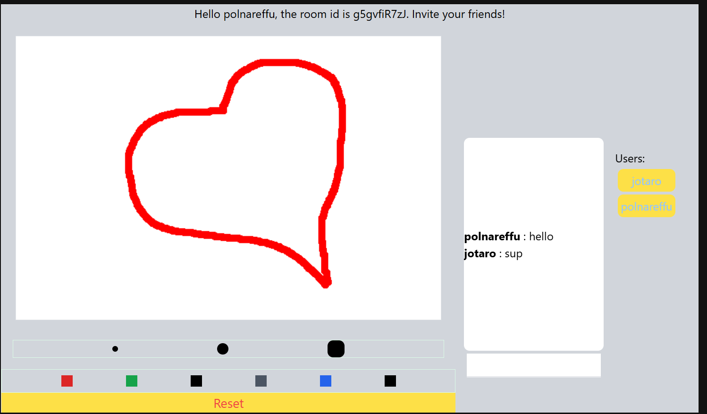

Connect now is a real time application where you can have fun with your friends!

Features:-
<ul>
  <li>Private rooms</li>
  <li>Chat</li>
  <li>Drawing board</li>
</ul>


Uses socket.io (websockets api) for communication


Made with React + Vite + Tailwind.


How to run:
```
git clone https://github.com/mikazaya/connect-now.git
```
Go to the main folder.
```
cd connect-now
```
```
cd frontend
npm run build
```
```
cd backend
npm run start
```

Enjoy!






